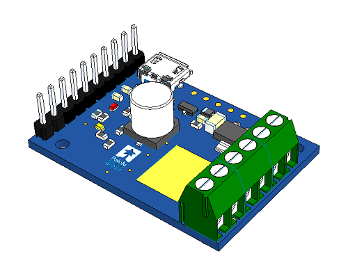

<!-- PyTic Readme -->
# PyTic v0.0.4   



---

## Introduction

`PyTic` is an object-oriented Python wrapper for the Pololu Tic stepper driver series. The wrapper interacts with the stepper driver device using the API described in the [Pololu-Tic-Software][pololu_tic_software] GitHub page using the ctypes library. The device comunication protocol is USB.

---

## Installation

### Prerequisites

`PyTic` requires the [Tic Software and Drivers for Windows][tic_drivers_win] msi provided by Pololu to be installed as a prerequisite. Other operating system drivers can be found on the [Pololu Tic Resources][tic_resources], but are not currently supported by this Python package.


### Pip Install

To install the `PyTic` package on a Windows machine equipped with Python 2.7 or higher, run the following `pip` command:

```console
C:\> pip install pytic
```

* Note: Only Windows x64 machines are supported at this time.

---


## Package Architecture

`PyTic` encompasses almost all functionality present in the original C-API with some additional features. The __Pololu Tic Stepper Driver__ is represented in Python using the `pytic.PyTic()` object. 

```console
----------------------------------
|     Package Relation Tree      |
----------------------------------

PyTic                 [Tic Object]
  |-- Settings        [Structure Interface Object]
      |- Pin Settings [Structure Interface Object] [List]
  |-- Variables       [Structure Interface Object]
      |- Pin Info     [Structure Interface Object] [List]
  |-- Logger          [Notification]

PyTic_Protocol        [Module]
  |-- Tic Constants   [Dictionary]
```

### PyTic Protocol (C-Constants Dictionary)
<a name="pytic_protocol"></a>

The __Pololu Tic C-API__ uses `CAPS_DEFINED_CONSTANTS` for setting many of its parameters that represent an integer value. These contants set parameters such as pin function, step mode, etc. The `PyTic` package auto-imports these values from the [tic_protocol.h][tic_protocol_h] header file and stores them in a Python dictionary named `tic_constants` in the `pytic_protocol` module. See [Using Settings](#using_settings) in the [Example Code](#example_code) section to see how to use this dictionary in contect.

### Error Handling

All __Pololu Tic C-API__ functions when dynamically imported into `PyTic` are wrapped in a higher-order function error handler called `TED()`, short for __[T]ic [E]rror [D]ecoder__. `TED()` will make all Tic wrapped functions return 0 from a successful call and 1 from a call that generated an error. In addition, `TED()` performs low-level bit mask decoding and writes the enumerated error value to the `PyTic` object internal log. This log can be output the ther terminal or file using the standard [logging][logging_lib] library.

---

## Example Code
<a name="example_code"></a>

Outlined in this section are several examples of how to use `PyTic` to control a __Pololu Tic Stepper Driver__. The objective of this section is to show the `PyTic` syntax used to implement the __Pololu Tic Stepper Driver C-API__ as opposed to detail each of the available functions. For a full list of commands, settings, and variable information please refer to either the [Pololu Tic Manual][pololu_tic_manual], the [Pololu Tic C-API][tic_h], or this package's source code.

### Simple Program
<a name="simple_program"></a>

The simple program below demonstrates how to connect to a __Pololu Tic Stepper Driver__ device over USB and move to several positions after the previous position has been reached.

```python
import pytic
from time import sleep

# - Initialization -------------------------------------------

tic = pytic.PyTic()

# Connect to first available Tic Device serial number over USB
serial_nums = tic.list_connected_device_serial_numbers()
tic.connect_to_serial_number(serial_nums[0])

# Load configuration file and apply settings
tic.settings.load_config('path\\to\\config.yml')
tic.settings.apply()                             

# - Motion Command Sequence ----------------------------------

# Zero current motor position
tic.halt_and_set_position(0)

# Energize Motor
tic.energize()
tic.exit_safe_start()

# Move to listed positions
positions = [1000, 2000, 3000, 0]
for p in positions:
  tic.set_target_position(p)
  while tic.variables.current_position != tic.variables.target_position:
    sleep(0.1)

# De-energize motor and get error status
tic.enter_safe_start()
tic.deenergize()
print(tic.variables.error_status)
```

* Note: Modified settings will not take effect until `PyTic.settings.apply()` method is called. This is to avoid unnecessary writes to non-volitile memory.

### Using Settings
<a name="using_settings"></a>

The `PyTic.settings` structure interface object is used to alter device settings stored in non-volitile memory. As detailed above in [PyTic Protocol](#pytic_protocol), some of these settings have enumerated constants to maintain a user-friendly interaction. The code sample below demonstrates how to interact with `PyTic.settings` using the `tic_constant` dictionary. To avoid unnecissary writes to non-volitile memory, the `PyTic.settings.apply()` function must be called for the new settings to take effect.

```python

# ... assume PyTic object initialized and connected to device as 'tic'

# Load Tic Constant Dictionary
tc = pytic.pytic_protocol.tic_constant

# Modify individual properties of composite settings object
tic.settings.product = tc['TIC_PRODUCT_T825']
tic.settings.step_mode = tc['TIC_STEP_MODE_MICROSTEP16']

# Turn the Serial RX Pin into a generic digital user input
pin = tc['TIC_PIN_NUM_RX']
tic.settings.pin_setting[pin].func = tc['TIC_PIN_FUNC_USER_INPUT']
tic.settings.pin_setting[pin].pullup = True

# Required to burn new settings to Tic non-volitile memory
tic.settings.apply()

```


<!---### Using Variables

```python

#quick pin examples

```
--->

---
## Logging

`PyTic` uses the `logging` package to display Tic status messages. The default logging level is `logging.DEBUG`. For less verbose logging, set `PyTic.log_level = logging.CRITICAL`. The log name is `PyTic` for users that would like to have a parent-object handle the logging information.


---
## Example YAML Configuration File

`PyTic` settings can be set invidually using the `PyTic.settings` structure interface in the script or all-at-once using a YAML config file and the `PyTic.settings.load_config('\\path\\to\\config.yml')` function. Here is an example YAML config file with some usage notes,

```yaml
tic_settings:                             # required header for load_config fcn.
  product: TIC_PRODUCT_T825    
  auto_clear_driver_error: True           # ** These 4 settings         **
  ignore_err_line_high: True              # ** were experimentally      **
  serial_crc_enabled: False               # ** determined to stabalize  **
  command_timeout: 0                      # ** device performance       **
  max_speed: 180000000                    # pulses/s * 10^-4
  starting_speed: 0                       # pulses/s * 10^-4
  max_accel: 9000000                      # pulses/s^2 * 10^-2
  max_decel: 9000000                      # pulses/s^2 * 10^-2
  step_mode: TIC_STEP_MODE_MICROSTEP16 
  current_limit: 640                    # mA, Only select values acceptable, See notes.
  decay_mode: TIC_DECAY_MODE_T825_FAST 
  pin_settings:                         # Ex. Modifying Default Pin Fcn.
    - pin_num: TIC_PIN_NUM_RX
      func: TIC_PIN_FUNC_USER_INPUT
      pullup: True
      analog: False
    # - pin_id: TIC_PIN_NUM_TX          # ... modifying a 2nd pin ...
    #   func: TIC_PIN_FUNC_USER_INPUT
    #   polarity: True
    #   analog: False
```

Notes:
* `CAPS_DEFINED_CONSTANTS` are keys for the `tic_constant` dictionary located in `pytic_protocol.py`. Refer to section [Using Settings](#using_settings) for more details on the dictionary and its use. 
* `current_limit` only accepts select values detailed in the [Pololu Tic Manual][pololu_tic_manual]

 
---

## Dependencies

Dependencies include the following,

* PyYAML

---

## Level of Support Notice

This code is currently not supported. It is being released to the community AS IS without any guarantee of support. The community is welcome to submit issues, but should not expect an active response.

---

## External Resources

External resources include the following,

* [logging Library][logging_lib]
* [Pololu-Tic-Software GitHub][pololu_tic_software]
* [Pololu Tic Manual][pololu_tic_manual]
* [Pololu Tic Resources][tic_resources]
* [tic.h][tic_h]
* [tic_protocol.h][tic_protocol_h]
* [Tic Software and Drivers for Windows][tic_drivers_win]

[pololu_tic_software]: https://github.com/pololu/pololu-tic-software
[pololu_tic_manual]: https://www.pololu.com/docs/0J71
[logging_lib]: https://docs.python.org/3/library/logging.html
[tic_protocol_h]: https://github.com/pololu/pololu-tic-software/blob/a75c204a2255554e21cc5351c528d930ba5d2c38/include/tic_protocol.h
[tic_drivers_win]: https://www.pololu.com/file/0J1325/pololu-tic-1.6.2-win.msi
[tic_resources]:https://www.pololu.com/product/3131/resources
[tic_h]: https://github.com/pololu/pololu-tic-software/blob/master/include/tic.h