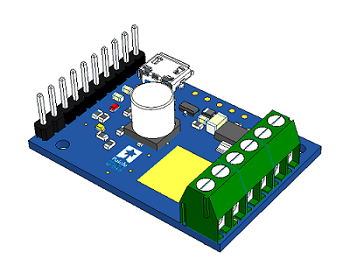

<!-- Falcon Optics Readme -->
# PyTic v0.0.2   



---

## Introduction

`PyTic` is an object-oriented Python wrapper for the Pololu Tic stepper driver series. The wrapper interacts with the stepper driver device using the API described in the [pololu-tic-software][pololu_tic_software] GitHub page using the ctypes library. The comunication protocol is USB.


---

## Installation

To install the `PyTic` package on a Windows machine equipped with Python 2.7 or higher, run the following `pip` command:

```console
C:\> pip install pytic
```

* Note: Only Windows x64 machines are supported at this time.

---

## Public Methods & Properties

`PyTic` encompasses almost all functionality present in the original C-API with some additional features. The Pololu Tic stepper driver is represented in Python using a `pytic.PyTic()` object. Below are some of the highlighted public methods and properties for interacting with the device. Users can follow the same syntax and reference the [Pololu Tic Manual][pololu_tic_manual] for a list of all possible commands.

```
----------------------------------
|     Package Relation Tree      |
----------------------------------

PyTic               [Object]
  |-- Settings      [Structure]
  |-- Variables     [Structure]
  |-- Logger        [Notification]

PyTic_Protocol      [Constants]
```
---

## Example Code

Example 

```python
import pytic

# Initialization
tic = pytic.PyTic()

# Connect to first available Tic Device serial number over USB
serial_nums = tic.list_connected_device_serial_numbers()
tic.connect_to_serial_number(serial_nums[0])


```


## Example YAML Configuration File


---

## Dependencies

Dependencies include the following,

* PyYAML

---

## External Resources

External resources include the following,

* [Pololu-Tic-Software GitHub][pololu_tic_software]
* [Pololu Tic Manual][pololu_tic_manual]

[pololu_tic_software]: https://github.com/pololu/pololu-tic-software
[pololu_tic_manual]: https://www.pololu.com/docs/0J71